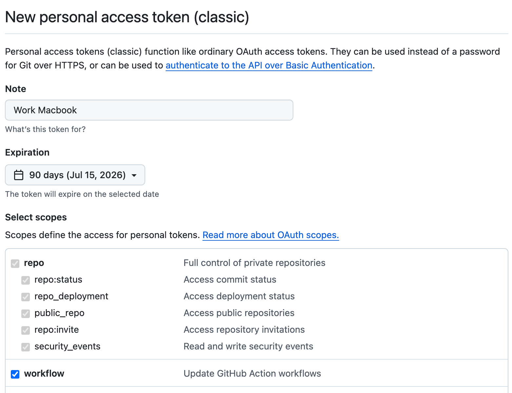

## Sending changes back to GitHub

Now that we have created some commits on our local machine, our local history of the repository is different from the one on GitHub. You can see this when running `git status` at the beginning of the message you should have  "Your branch is ahead of 'origin/master' by `N` commits". This can be translated as you have `N` additional commits on your local machine that you haven't shared back to the remote repository on GitHub. 

Open your favorite web browser and look at the content of your repository on GitHub. You will see there is no `desserts.py` file on GitHub.

### Downstream and upstream

In `git` lingo, the local version of the repository is called the **downstream** and the remote version of the repository (on GitHub) is called the **upstream**.

If we want to synchronize the upstream with the downstream, we can use two git commands:

-  `pull`: git will get the latest remote (GitHub in our case) version and try to merge it with your local version
-  `push`: git will send your local version to the remote version of the repository 

Before sending your local version to the remote, you should ensure that you have the latest remote version first. In other words, **you should pull first and push second**. This is the way git protects the remote version against incompatibilities with the local version.

::: {.callout-note appearance="simple" collapse="true"}
## Git workflows

Although the pull-then-push workflow is the most common one, there are other workflows that can be used when working with git. For example, you can push your local version to GitHub without pulling first. This is called a "force push" and it can be useful in some cases, but it can also cause problems if you are not careful. Another option is using `fetch` instead of `pull`. The `fetch` command will get the latest remote version without trying to merge it with your local version. This can be useful if you want to review the changes on the remote version before merging them with your local version.

You can explore more about git workflows in Scott Chacon and Ben Straub, [_Pro Git_](https://git-scm.com/book/en/v2/Git-Branching-Branching-Workflows) book.

:::


## GitHub credentials

Normally if you have already used GitHub tokens your Operating System (Windows, MacOSX, ...) should have cached the necessary credentials to log in to your GitHub account (required to push (write) content to the remote repository).

### Setting up your GitHub Token

You can find the latest guidelines on how to setup your personal GitHub token **[here](https://docs.github.com/en/authentication/keeping-your-account-and-data-secure/managing-your-personal-access-tokens#creating-a-personal-access-token-classic)**

Start by going to your GitHub account and click on your profile picture in the top right corner, then select `Settings` from the dropdown menu. In the left sidebar, click on `Developer settings`, then click on `Personal access tokens`, and finally click on `Tokens (classic)`. Or, click on the following link: [Personal Access Tokens\(classic\)](https://github.com/settings/tokens).

Then click on the `Generate new token` button and select `Generate new token (classic)`.

1. Choose a token name that is related to the machine you are using (is a good practice :) )

2. Set the expiration date to `90 days`

3. We recommend to select the following options:

   - all repo actions
   - workflow

   {width="65%" fig-alt="Screenshot of the GitHub Personal Access Token (classic) settings page with recommended permissions selected (repo actions and workflow)."}

4. Then click the `Generate token` button at the bottom of the page.

**DO NOT CLOSE the next page** as it will be the only time you can see your token.

Copy your token to your clipboard and then push to GitHub from the command line using `git push`. When you are prompted for your password, paste your token.

Once it works your token will be safely stored by your OS password manager. Then you can close the GitHub webpage displaying your token value.

::: {.callout-tip appearance="simple" collapse="true"}
## What if I forget my token?

If you forget or lose your token, you can regenerate it by going back to the `Personal access tokens` page on GitHub, select the token you want to regenerate, and click on the `Regenerate` button. This will invalidate the old token and generate a new one. You will need to use the new token the next time you push to GitHub from the command line.
:::

:::{.callout-tip appearance="simple" collapse="true"}
### Connect to GitHub with SSH

Another option is to set up the method that is commonly used by many different services to authenticate access on the command line.  This method is called Secure Shell Protocol (SSH).  SSH is a cryptographic network protocol that allows secure communication between computers using an otherwise insecure network.

SSH uses what is called a key pair. This is **two** keys that work together to validate access. One key is publicly known and called the **public key**, and the other key called the **private key** is kept private. Very descriptive names.

{width="50%" fig-alt="Animated movie scene used as an analogy for SSH authentication: two keys are required together, similar to a public and private key pair."}

You can think of the public key as a padlock, and only you have the key (the private key) to open it. You use the public key where you want a secure method of communication, such as your GitHub account.  You give this padlock, or public key, to GitHub and say "lock the communications to my account with this so that only computers that have my private key can unlock communications and send git commands as my GitHub account."

The first thing we are going to do is check if this has already been done on the computer you're on.  Because generally speaking, this setup only needs to happen once and then you can forget about it:

```bash
ls -al ~/.ssh
```

Your output is going to look a little different depending on whether or not SSH has ever been set up on the computer you are using.


#### Already set up: 

If SSH has been set up on the computer you're using, the public and private key pairs will be listed. The file names are either `id_ed25519`/`id_ed25519.pub` or `id_rsa`/`id_rsa.pub` depending on how the key pairs were set up.  

#### Not Set up:

```bash
ls: cannot access '/Users/<your-username>/.ssh': No such file or directory
```

Create an SSH key pair

To create an SSH key pair Vlad uses this command, where the `-t` option specifies which type of algorithm to use and `-C` attaches a comment to the key (here, Vlad's email):

```bash
$ ssh-keygen -t ed25519 -C "youremail@provider.org"
```

If you are using a legacy system that doesn't support the Ed25519 algorithm, use:

`$ ssh-keygen -t rsa -b 4096 -C "your_email@example.com"`

```
Generating public/private ed25519 key pair.
Enter file in which to save the key (/Users/<your-username>/.ssh/id_ed25519):
```

We want to use the default file, so just press <kbd>Enter</kbd>.

```output
Created directory '/Users/<your-username>/.ssh'.
Enter passphrase (empty for no passphrase):
```

Now, it is prompting you for a passphrase. Be sure to use something memorable or save your passphrase somewhere, as there is no "reset my password" option.

:::{.callout-warning}
When you enter password at the shell, the keystrokes do not produce the usual "dot" showing you that you are typing, but your keystrokes are being registered... so keep typing you password !!
:::

```
Enter same passphrase again:
```

After entering the same passphrase a second time, we receive the confirmation

```
Your identification has been saved in /Users/<your-username>/.ssh/id_ed25519
Your public key has been saved in /Users/<your-username>/.ssh/id_ed25519.pub
The key fingerprint is:
SHA256:SMSPIStNyA00KPxuYu94KpZgRAYjgt9g4BA4kFy3g1o vlad@tran.sylvan.ia
The key's randomart image is:
+--[ED25519 256]--+
|^B== o.          |
|%*=.*.+          |
|+=.E =.+         |
| .=.+.o..        |
|....  . S        |
|.+ o             |
|+ =              |
|.o.o             |
|oo+.             |
+----[SHA256]-----+
```

The "identification" is actually the private key. You should never share it.  The public key is appropriately named.  The "key fingerprint" is a shorter version of a public key.

Now that we have generated the SSH keys, we will find the SSH files when we check.

```bash
ls -al ~/.ssh
```

```bash
drwxr-xr-x 1 <your-username>  staff 197121  Oct 23  13:14 ./
drwxr-xr-x 1 <your-username>  staff 197121  Mar 11  09:21 ../
-rw------- 1 <your-username>  staff    464  Apr 21  2023 id_ed25519
-rw-r--r-- 1 <your-username>  staff    103  Apr 21  2023 id_ed25519.pub
```
:::

## Synchronize with GitHub

Now that everything is set up, we can push our local version to the remote repository on GitHub.

First, let's be sure that we have the latest version of the remote repository on our local machine:

```bash
git pull
```

Next, we can send (push) our changes to the remove repository on GitHub:

```bash
git push
```

Refresh the repository webpage, you should now see all the changes you have made locally in the previous section.


## Aknowledgements

This section is adapted from Seth Erickson's version of the Software Carpentry [introduction to git](https://ucsbcarpentry.github.io/git-novice/)

