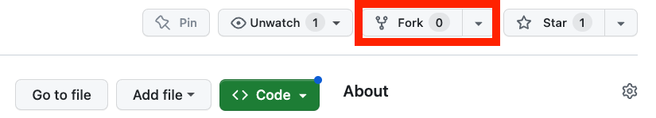

## Sending changes back to GitHub

Now that we have created these two commits on our local machine, our local version of the repository is different from the version on GitHub. You can see this when running `git status` at the beginning of the message you should have  "Your branch is ahead of 'origin/master' by two commits". This can be translated as you have two additional commits on your local machine that you never shared back to the remote repository on GitHub. Open your favorite web browser and look at the content of your repository on GitHub. You will see there is no `index.md` file on GitHub.


There are two git commands to exchange between local and remote versions of a repository:

- `pull`: git will get the latest remote (GitHub in our case) version and try to merge it with your local version
- `push`: git will send your local version to the remote version of the repository 

Before sending your local version to the remote, you should always get the latest remote version first. In other words, **you should pull first and push second**. This is the way git protects the remote version against incompatibilities with the local version. You always deal with potential problems on your local machine. Therefore your sequence will always be:

1. `pull`
2. `push`


## GitHub credentials

Normally if you have already used GitHub tokens your Operating System (Windows, MacOSX, ...) should have cached the necessary credentials to log in to your GitHub account (necessary to be able to push (write) content to the remote repository).

### Setting up your GitHub Token

You can find the latest guidelines on how to setup your personal GitHub token **[here](https://docs.github.com/en/authentication/keeping-your-account-and-data-secure/managing-your-personal-access-tokens#creating-a-personal-access-token-classic)**

1. Choose a token name that is related to the machine you are using (not requires, but a good idea :) )

2. Set the expiration date to `90 days`

3. We recommend to select the following options:

   - all repo actions
   - workflow
   - gist
   - all user actions

   {width="65%"}

4. Then click the `Generate token` button at the bottom of the page.

**DO NOT CLOSE the next page** as it will be the only time you can see your token.

Copy your token to your clipboard and then push to GitHub from the command line using `git push`. When you are prompted for your password, copy your token.

Only once it has worked and that your token as been cached by your OS password manager you can close the GitHub webpage displaying your token value.


### Setting up your SSH key

Another option is to set up the method that is commonly used by many different services to authenticate access on the command line.  This method is called Secure Shell Protocol (SSH).  SSH is a cryptographic network protocol that allows secure communication between computers using an otherwise insecure network.

SSH uses what is called a key pair. This is **two** keys that work together to validate access. One key is publicly known and called the **public key**, and the other key called the **private key** is kept private. Very descriptive names.

You can think of the public key as a padlock, and only you have the key (the private key) to open it. You use the public key where you want a secure method of communication, such as your GitHub account.  You give this padlock, or public key, to GitHub and say "lock the communications to my account with this so that only computers that have my private key can unlock communications and send git commands as my GitHub account."

The first thing we are going to do is check if this has already been done on the computer you're on.  Because generally speaking, this setup only needs to happen once and then you can forget about it:

```bash
ls -al ~/.ssh
```

Your output is going to look a little different depending on whether or not SSH has ever been set up on the computer you are using.


#### Already set up: 

If SSH has been set up on the computer you're using, the public and private key pairs will be listed. The file names are either `id_ed25519`/`id_ed25519.pub` or `id_rsa`/`id_rsa.pub` depending on how the key pairs were set up.  

#### Not Set up:

```bash
ls: cannot access '/Users/brunj7/.ssh': No such file or directory
```

Create an SSH key pair

To create an SSH key pair Vlad uses this command, where the `-t` option specifies which type of algorithm to use and `-C` attaches a comment to the key (here, Vlad's email):

```bash
$ ssh-keygen -t ed25519 -C "youremail@provider.org"
```

If you are using a legacy system that doesn't support the Ed25519 algorithm, use:

`$ ssh-keygen -t rsa -b 4096 -C "your_email@example.com"`

```
Generating public/private ed25519 key pair.
Enter file in which to save the key (/Users/brunj7/.ssh/id_ed25519):
```

We want to use the default file, so just press <kbd>Enter</kbd>.

```output
Created directory '/Users/brunj7/.ssh'.
Enter passphrase (empty for no passphrase):
```

Now, it is prompting you for a passphrase. Be sure to use something memorable or save your passphrase somewhere, as there is no "reset my password" option.

:::{.callout-warning}
When you enter password at the shell, the keystrokes do not produce the usual "dot" showing you that you are typing, but your keystrokes are being registered... so keep typing you password !!
:::

```
Enter same passphrase again:
```

After entering the same passphrase a second time, we receive the confirmation

```
Your identification has been saved in /Users/brunj7/.ssh/id_ed25519
Your public key has been saved in /Users/brunj7/.ssh/id_ed25519.pub
The key fingerprint is:
SHA256:SMSPIStNyA00KPxuYu94KpZgRAYjgt9g4BA4kFy3g1o vlad@tran.sylvan.ia
The key's randomart image is:
+--[ED25519 256]--+
|^B== o.          |
|%*=.*.+          |
|+=.E =.+         |
| .=.+.o..        |
|....  . S        |
|.+ o             |
|+ =              |
|.o.o             |
|oo+.             |
+----[SHA256]-----+
```

The "identification" is actually the private key. You should never share it.  The public key is appropriately named.  The "key fingerprint" is a shorter version of a public key.

Now that we have generated the SSH keys, we will find the SSH files when we check.

```bash
ls -al ~/.ssh
```

```bash
drwxr-xr-x 1 brunj7  staff 197121  Oct 23  13:14 ./
drwxr-xr-x 1 brunj7  staff 197121  Mar 11  09:21 ../
-rw------- 1 brunj7  staff    464  Apr 21  2023 id_ed25519
-rw-r--r-- 1 brunj7  staff    103  Apr 21  2023 id_ed25519.pub
```


Let's do it:

```bash
git pull
```

Normally nothing should have changed on the remote

Now we can push our changes to GitHub:

```bash
git push
```

Refresh the repository webpage, you should now see the `index.md` file!


<hr>


### Fork Workflow

If you want to contribute to a repository that you have not been added to as a collaborator, you need to first fork the repository. This creates a linked copy under your username that you can edit. Once you are done with your contribution, you can send a request to incorporate your changes to the original repository using what is called a Pull Request, in other words, you ask the repository owner to pull your changes into their repository.


::: {.callout-tip}

### Prompt

With **another** collaborator keep logging information about people's favorite desserts using the fork workflow.

:::

#### Person 2: Create a Fork of the Person 1 repository

- Get the link the repository from Person 1 via the Zoom chat
- Go to their repository webpage
- Create a Fork by clicking on the Fork button on the top right view of your repository homepage

```{r fork-button, out.width="60%", echo=FALSE}

```

- On your Fork, start editing the `README.md` 
- Add the name of a friend and their favorite dessert below your previous entries: e.g.  ` - Eliott: donut`
- Add a descriptive commit message

```{r echo=FALSE}
knitr::include_graphics("img/github-commit.png")
```

- Commit your changes

```{r commit-button2, out.width="20%", echo=FALSE}
knitr::include_graphics("img/github-commit-button.png")
```
- Create a Pull Request (PR) to merge those changes to the main repository using these [instructions](https://docs.github.com/en/pull-requests/collaborating-with-pull-requests/proposing-changes-to-your-work-with-pull-requests/creating-a-pull-request-from-a-fork)


#### Person 1:

- Go to *your* repository and merge the PR


## Aknowledgements

This section is adapted from Seth Erickson's version of the Software Carpentry [introduction to git](https://ucsbcarpentry.github.io/git-novice/)

