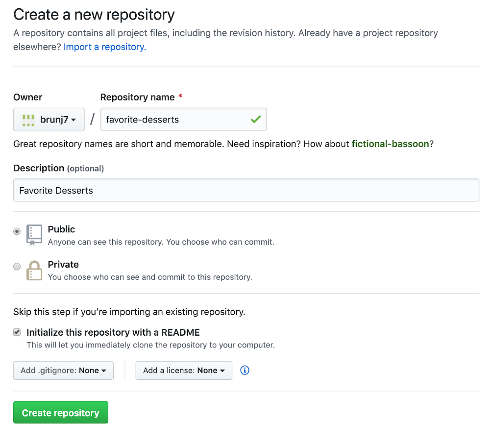
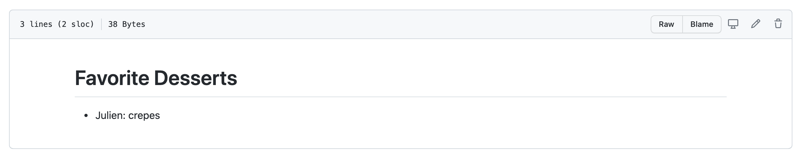
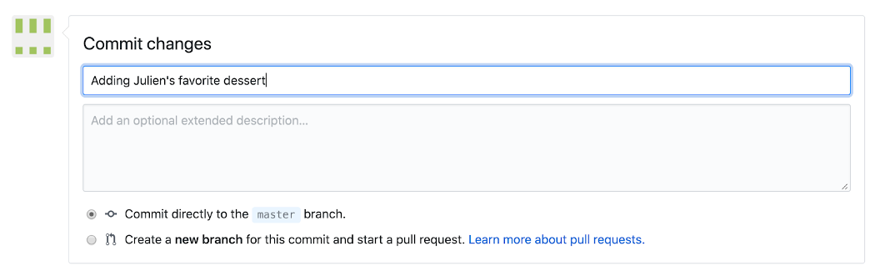

In this section, we will be using the GitHub.com website and demonstrate that you do not need to be a programmer to use version control and edit files on GitHub.

::: {.callout-note collapse=true}
### Don't have a GitHub account?

If you have not already created a GitHub username, please do so now:

- GitHub: <https://github.com>
- Follow optional [advice on choosing your username](https://happygitwithr.com/github-acct.html)
:::


::: {.callout-tip}
### Our asks

### As a Team of two

- Help each other, everyone is bringing different skills! Talk it out!
- Listen to each other; avoid judgment and solutioneering.
- Have fun!


### Prompt

We want to log the information about people's favorite desserts using this repository.
:::


## Create a new repository

- Create a repository using the following  [instructions](https://docs.github.com/en/github/getting-started-with-github/create-a-repo) steps 1-6



## Edit the README

We want to make the following changes: 

   - Replace the title (first line starting with `#`) with something better! Maybe `Favorite Desserts`
   - Add your name and your favorite dessert below the title: e.g.  ` - Julien: crepes`

```{r echo=FALSE}

```

- Ask your partner what is their favorite desserts and add it to the list
- Think of a relative and their potential favorite desserts and add it to the list; e.g.  ` - Sophia: chocolate`

## Commit your changes

- Click _Commit changes_
- Add a descriptive commit message, "add my favorite dessert"

```{r echo=FALSE}

```

- Click _Commit changes_ to confirm

```{r commit-button, out.width="20%", echo=FALSE}

```


## Add a csv file

Download this [csv file](https://raw.githubusercontent.com/brunj7/eds214-handson-ghcollab/main/data/iconic_desserts.csv) about the most iconic desserts in America (according to this website <https://www.eatthis.com/iconic-desserts-united-states/>) to your computer. Note: depending on your web browser settings you might have to right-click on the page and select _Save As_.

- Drag and drop it on the Github web page of your repository to upload it
- Add a short message about the file e.g. `Add iconic_desserts.csv` & hit `Commit changes`
- Your file has been uploaded 🪄. Click on the filename to see it!

You should have something similar to this repo: <https://github.com/brunj7/favorite-desserts>


## Add an R script

This is the script we used to scrape the iconic desserts listing: 

```{r getting the data, eval=FALSE, message = FALSE, warning = FALSE}
library(tidyverse)
library(rvest)  # use to scrape website content

# Check if that data folder exists and create it if not
dir.create("data", showWarnings = FALSE)

# Read the webpage code
webpage <- read_html("https://www.eatthis.com/iconic-desserts-united-states/")

# Extract the desserts listing
dessert_elements<- html_elements(webpage, "h2")
dessert_listing <- dessert_elements %>% 
  html_text2() %>%             # extracting the text associated with this type of element of the webpage
  as_tibble() %>%              # make it a data frame
  rename(dessert = value) %>%  # better name for the column
  head(.,-3) %>%               # 3 last ones were not desserts 
  rowid_to_column("rank") %>%  # adding a column using the row number as proxy for the rank
  write_csv("data/iconic_desserts.csv") # save it as csv
```


How would you add this code as an R Script to your repository?

- Copy-paste the above code to your favorite text editor / IDE
- Save the file as `iconic_desserts.R`
- Drag and drop it on the Github web page of your repository


### Bonus 

- Try to edit the csv file directly on GitHub to add your favorite dessert to the iconic list! 


***No need to be a programmer to contribute to analytical workflows with GitHub!!***


