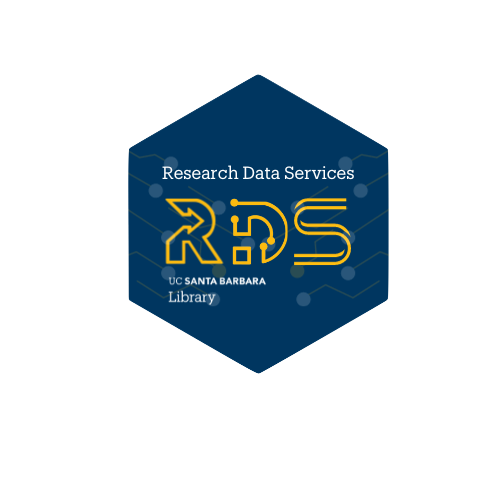

## Learning Outcomes

- Have a better knowledge of version control
- Have a better understanding of the basic git workflow: `commit-pull-push`
- Have a better grasp of how you can collaborate using the GitHub website
- Wanting to know more about git and GitHub, it's a journey we hop you'll start yours!!!

## Session Overview

- What is version control
- How to leverage `git` in your work
- Collaborative coding with `GitHub`
- Working on your local machine
- Sharing your code with `GitHub`

 

{fig-align="center" width=50% fig-alt="Research Data Service logo"}